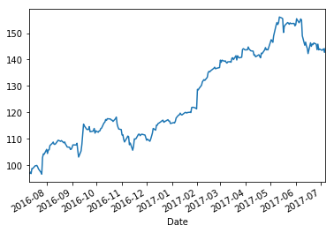
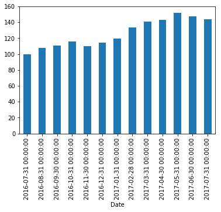

<h1 style="color:blue" align="center">Pandas Time Series Tutorial: DateTimeIndex</h1>


```python
import pandas as pd
df = pd.read_csv("aapl.csv",parse_dates=["Date"], index_col="Date")
df.head(2)
```


<div>
<style>
    .dataframe thead tr:only-child th {
        text-align: right;
    }

    .dataframe thead th {
        text-align: left;
    }

    .dataframe tbody tr th {
        vertical-align: top;
    }
</style>
<table border="1" class="dataframe">
  <thead>
    <tr style="text-align: right;">
      <th></th>
      <th>Open</th>
      <th>High</th>
      <th>Low</th>
      <th>Close</th>
      <th>Volume</th>
    </tr>
    <tr>
      <th>Date</th>
      <th></th>
      <th></th>
      <th></th>
      <th></th>
      <th></th>
    </tr>
  </thead>
  <tbody>
    <tr>
      <th>2017-07-07</th>
      <td>142.90</td>
      <td>144.75</td>
      <td>142.90</td>
      <td>144.18</td>
      <td>19201712</td>
    </tr>
    <tr>
      <th>2017-07-06</th>
      <td>143.02</td>
      <td>143.50</td>
      <td>142.41</td>
      <td>142.73</td>
      <td>24128782</td>
    </tr>
  </tbody>
</table>
</div>


```python
df.index
```


    DatetimeIndex(['2017-07-07', '2017-07-06', '2017-07-05', '2017-07-03',
                   '2017-06-30', '2017-06-29', '2017-06-28', '2017-06-27',
                   '2017-06-26', '2017-06-23',
                   ...
                   '2016-07-22', '2016-07-21', '2016-07-20', '2016-07-19',
                   '2016-07-18', '2016-07-15', '2016-07-14', '2016-07-13',
                   '2016-07-12', '2016-07-11'],
                  dtype='datetime64[ns]', name='Date', length=251, freq=None)


<h3 style="color:purple">What is DatetimeIndex? Benefits of it</h3>

<h4> (1) Partial Date Index: Select Specific Months Data</h4>


```python
df['2017-06-30']
```


<div>
<style>
    .dataframe thead tr:only-child th {
        text-align: right;
    }

    .dataframe thead th {
        text-align: left;
    }

    .dataframe tbody tr th {
        vertical-align: top;
    }
</style>
<table border="1" class="dataframe">
  <thead>
    <tr style="text-align: right;">
      <th></th>
      <th>Open</th>
      <th>High</th>
      <th>Low</th>
      <th>Close</th>
      <th>Volume</th>
    </tr>
    <tr>
      <th>Date</th>
      <th></th>
      <th></th>
      <th></th>
      <th></th>
      <th></th>
    </tr>
  </thead>
  <tbody>
    <tr>
      <th>2017-06-30</th>
      <td>144.45</td>
      <td>144.96</td>
      <td>143.78</td>
      <td>144.02</td>
      <td>23024107</td>
    </tr>
  </tbody>
</table>
</div>


```python
df["2017-01"]
```


<div>
<style>
    .dataframe thead tr:only-child th {
        text-align: right;
    }

    .dataframe thead th {
        text-align: left;
    }

    .dataframe tbody tr th {
        vertical-align: top;
    }
</style>
<table border="1" class="dataframe">
  <thead>
    <tr style="text-align: right;">
      <th></th>
      <th>Open</th>
      <th>High</th>
      <th>Low</th>
      <th>Close</th>
      <th>Volume</th>
    </tr>
    <tr>
      <th>Date</th>
      <th></th>
      <th></th>
      <th></th>
      <th></th>
      <th></th>
    </tr>
  </thead>
  <tbody>
    <tr>
      <th>2017-01-31</th>
      <td>121.15</td>
      <td>121.39</td>
      <td>120.62</td>
      <td>121.35</td>
      <td>49200993</td>
    </tr>
    <tr>
      <th>2017-01-30</th>
      <td>120.93</td>
      <td>121.63</td>
      <td>120.66</td>
      <td>121.63</td>
      <td>30377503</td>
    </tr>
    <tr>
      <th>2017-01-27</th>
      <td>122.14</td>
      <td>122.35</td>
      <td>121.60</td>
      <td>121.95</td>
      <td>20562944</td>
    </tr>
    <tr>
      <th>2017-01-26</th>
      <td>121.67</td>
      <td>122.44</td>
      <td>121.60</td>
      <td>121.94</td>
      <td>26337576</td>
    </tr>
    <tr>
      <th>2017-01-25</th>
      <td>120.42</td>
      <td>122.10</td>
      <td>120.28</td>
      <td>121.88</td>
      <td>32586673</td>
    </tr>
    <tr>
      <th>2017-01-24</th>
      <td>119.55</td>
      <td>120.10</td>
      <td>119.50</td>
      <td>119.97</td>
      <td>23211038</td>
    </tr>
    <tr>
      <th>2017-01-23</th>
      <td>120.00</td>
      <td>120.81</td>
      <td>119.77</td>
      <td>120.08</td>
      <td>22050218</td>
    </tr>
    <tr>
      <th>2017-01-20</th>
      <td>120.45</td>
      <td>120.45</td>
      <td>119.73</td>
      <td>120.00</td>
      <td>32597892</td>
    </tr>
    <tr>
      <th>2017-01-19</th>
      <td>119.40</td>
      <td>120.09</td>
      <td>119.37</td>
      <td>119.78</td>
      <td>25597291</td>
    </tr>
    <tr>
      <th>2017-01-18</th>
      <td>120.00</td>
      <td>120.50</td>
      <td>119.71</td>
      <td>119.99</td>
      <td>23712961</td>
    </tr>
    <tr>
      <th>2017-01-17</th>
      <td>118.34</td>
      <td>120.24</td>
      <td>118.22</td>
      <td>120.00</td>
      <td>34439843</td>
    </tr>
    <tr>
      <th>2017-01-13</th>
      <td>119.11</td>
      <td>119.62</td>
      <td>118.81</td>
      <td>119.04</td>
      <td>26111948</td>
    </tr>
    <tr>
      <th>2017-01-12</th>
      <td>118.90</td>
      <td>119.30</td>
      <td>118.21</td>
      <td>119.25</td>
      <td>27086220</td>
    </tr>
    <tr>
      <th>2017-01-11</th>
      <td>118.74</td>
      <td>119.93</td>
      <td>118.60</td>
      <td>119.75</td>
      <td>27588593</td>
    </tr>
    <tr>
      <th>2017-01-10</th>
      <td>118.77</td>
      <td>119.38</td>
      <td>118.30</td>
      <td>119.11</td>
      <td>24462051</td>
    </tr>
    <tr>
      <th>2017-01-09</th>
      <td>117.95</td>
      <td>119.43</td>
      <td>117.94</td>
      <td>118.99</td>
      <td>33561948</td>
    </tr>
    <tr>
      <th>2017-01-06</th>
      <td>116.78</td>
      <td>118.16</td>
      <td>116.47</td>
      <td>117.91</td>
      <td>31751900</td>
    </tr>
    <tr>
      <th>2017-01-05</th>
      <td>115.92</td>
      <td>116.86</td>
      <td>115.81</td>
      <td>116.61</td>
      <td>22193587</td>
    </tr>
    <tr>
      <th>2017-01-04</th>
      <td>115.85</td>
      <td>116.51</td>
      <td>115.75</td>
      <td>116.02</td>
      <td>21118116</td>
    </tr>
    <tr>
      <th>2017-01-03</th>
      <td>115.80</td>
      <td>116.33</td>
      <td>114.76</td>
      <td>116.15</td>
      <td>28781865</td>
    </tr>
  </tbody>
</table>
</div>


```python
df['2017-06'].head() 
```


<div>
<style>
    .dataframe thead tr:only-child th {
        text-align: right;
    }

    .dataframe thead th {
        text-align: left;
    }

    .dataframe tbody tr th {
        vertical-align: top;
    }
</style>
<table border="1" class="dataframe">
  <thead>
    <tr style="text-align: right;">
      <th></th>
      <th>Open</th>
      <th>High</th>
      <th>Low</th>
      <th>Close</th>
      <th>Volume</th>
    </tr>
    <tr>
      <th>Date</th>
      <th></th>
      <th></th>
      <th></th>
      <th></th>
      <th></th>
    </tr>
  </thead>
  <tbody>
    <tr>
      <th>2017-06-30</th>
      <td>144.45</td>
      <td>144.96</td>
      <td>143.78</td>
      <td>144.02</td>
      <td>23024107</td>
    </tr>
    <tr>
      <th>2017-06-29</th>
      <td>144.71</td>
      <td>145.13</td>
      <td>142.28</td>
      <td>143.68</td>
      <td>31499368</td>
    </tr>
    <tr>
      <th>2017-06-28</th>
      <td>144.49</td>
      <td>146.11</td>
      <td>143.16</td>
      <td>145.83</td>
      <td>22082432</td>
    </tr>
    <tr>
      <th>2017-06-27</th>
      <td>145.01</td>
      <td>146.16</td>
      <td>143.62</td>
      <td>143.73</td>
      <td>24761891</td>
    </tr>
    <tr>
      <th>2017-06-26</th>
      <td>147.17</td>
      <td>148.28</td>
      <td>145.38</td>
      <td>145.82</td>
      <td>25692361</td>
    </tr>
  </tbody>
</table>
</div>


<h4>Average price of aapl's stock in June, 2017</h4>


```python
df['2017-06'].Close.mean()
```


    147.8313636363636


```python
df['2017'].head(2) 
```


<div>
<style>
    .dataframe thead tr:only-child th {
        text-align: right;
    }

    .dataframe thead th {
        text-align: left;
    }

    .dataframe tbody tr th {
        vertical-align: top;
    }
</style>
<table border="1" class="dataframe">
  <thead>
    <tr style="text-align: right;">
      <th></th>
      <th>Open</th>
      <th>High</th>
      <th>Low</th>
      <th>Close</th>
      <th>Volume</th>
    </tr>
    <tr>
      <th>Date</th>
      <th></th>
      <th></th>
      <th></th>
      <th></th>
      <th></th>
    </tr>
  </thead>
  <tbody>
    <tr>
      <th>2017-07-07</th>
      <td>142.90</td>
      <td>144.75</td>
      <td>142.90</td>
      <td>144.18</td>
      <td>19201712</td>
    </tr>
    <tr>
      <th>2017-07-06</th>
      <td>143.02</td>
      <td>143.50</td>
      <td>142.41</td>
      <td>142.73</td>
      <td>24128782</td>
    </tr>
  </tbody>
</table>
</div>


<h4>(2) Select Date Range</h4>


```python
df['2017-01-08':'2017-01-03']
```


<div>
<style>
    .dataframe thead tr:only-child th {
        text-align: right;
    }

    .dataframe thead th {
        text-align: left;
    }

    .dataframe tbody tr th {
        vertical-align: top;
    }
</style>
<table border="1" class="dataframe">
  <thead>
    <tr style="text-align: right;">
      <th></th>
      <th>Open</th>
      <th>High</th>
      <th>Low</th>
      <th>Close</th>
      <th>Volume</th>
    </tr>
    <tr>
      <th>Date</th>
      <th></th>
      <th></th>
      <th></th>
      <th></th>
      <th></th>
    </tr>
  </thead>
  <tbody>
    <tr>
      <th>2017-01-06</th>
      <td>116.78</td>
      <td>118.16</td>
      <td>116.47</td>
      <td>117.91</td>
      <td>31751900</td>
    </tr>
    <tr>
      <th>2017-01-05</th>
      <td>115.92</td>
      <td>116.86</td>
      <td>115.81</td>
      <td>116.61</td>
      <td>22193587</td>
    </tr>
    <tr>
      <th>2017-01-04</th>
      <td>115.85</td>
      <td>116.51</td>
      <td>115.75</td>
      <td>116.02</td>
      <td>21118116</td>
    </tr>
    <tr>
      <th>2017-01-03</th>
      <td>115.80</td>
      <td>116.33</td>
      <td>114.76</td>
      <td>116.15</td>
      <td>28781865</td>
    </tr>
  </tbody>
</table>
</div>


```python
df['2017-01']
```


<div>
<style>
    .dataframe thead tr:only-child th {
        text-align: right;
    }

    .dataframe thead th {
        text-align: left;
    }

    .dataframe tbody tr th {
        vertical-align: top;
    }
</style>
<table border="1" class="dataframe">
  <thead>
    <tr style="text-align: right;">
      <th></th>
      <th>Open</th>
      <th>High</th>
      <th>Low</th>
      <th>Close</th>
      <th>Volume</th>
    </tr>
    <tr>
      <th>Date</th>
      <th></th>
      <th></th>
      <th></th>
      <th></th>
      <th></th>
    </tr>
  </thead>
  <tbody>
    <tr>
      <th>2017-01-31</th>
      <td>121.15</td>
      <td>121.39</td>
      <td>120.62</td>
      <td>121.35</td>
      <td>49200993</td>
    </tr>
    <tr>
      <th>2017-01-30</th>
      <td>120.93</td>
      <td>121.63</td>
      <td>120.66</td>
      <td>121.63</td>
      <td>30377503</td>
    </tr>
    <tr>
      <th>2017-01-27</th>
      <td>122.14</td>
      <td>122.35</td>
      <td>121.60</td>
      <td>121.95</td>
      <td>20562944</td>
    </tr>
    <tr>
      <th>2017-01-26</th>
      <td>121.67</td>
      <td>122.44</td>
      <td>121.60</td>
      <td>121.94</td>
      <td>26337576</td>
    </tr>
    <tr>
      <th>2017-01-25</th>
      <td>120.42</td>
      <td>122.10</td>
      <td>120.28</td>
      <td>121.88</td>
      <td>32586673</td>
    </tr>
    <tr>
      <th>2017-01-24</th>
      <td>119.55</td>
      <td>120.10</td>
      <td>119.50</td>
      <td>119.97</td>
      <td>23211038</td>
    </tr>
    <tr>
      <th>2017-01-23</th>
      <td>120.00</td>
      <td>120.81</td>
      <td>119.77</td>
      <td>120.08</td>
      <td>22050218</td>
    </tr>
    <tr>
      <th>2017-01-20</th>
      <td>120.45</td>
      <td>120.45</td>
      <td>119.73</td>
      <td>120.00</td>
      <td>32597892</td>
    </tr>
    <tr>
      <th>2017-01-19</th>
      <td>119.40</td>
      <td>120.09</td>
      <td>119.37</td>
      <td>119.78</td>
      <td>25597291</td>
    </tr>
    <tr>
      <th>2017-01-18</th>
      <td>120.00</td>
      <td>120.50</td>
      <td>119.71</td>
      <td>119.99</td>
      <td>23712961</td>
    </tr>
    <tr>
      <th>2017-01-17</th>
      <td>118.34</td>
      <td>120.24</td>
      <td>118.22</td>
      <td>120.00</td>
      <td>34439843</td>
    </tr>
    <tr>
      <th>2017-01-13</th>
      <td>119.11</td>
      <td>119.62</td>
      <td>118.81</td>
      <td>119.04</td>
      <td>26111948</td>
    </tr>
    <tr>
      <th>2017-01-12</th>
      <td>118.90</td>
      <td>119.30</td>
      <td>118.21</td>
      <td>119.25</td>
      <td>27086220</td>
    </tr>
    <tr>
      <th>2017-01-11</th>
      <td>118.74</td>
      <td>119.93</td>
      <td>118.60</td>
      <td>119.75</td>
      <td>27588593</td>
    </tr>
    <tr>
      <th>2017-01-10</th>
      <td>118.77</td>
      <td>119.38</td>
      <td>118.30</td>
      <td>119.11</td>
      <td>24462051</td>
    </tr>
    <tr>
      <th>2017-01-09</th>
      <td>117.95</td>
      <td>119.43</td>
      <td>117.94</td>
      <td>118.99</td>
      <td>33561948</td>
    </tr>
    <tr>
      <th>2017-01-06</th>
      <td>116.78</td>
      <td>118.16</td>
      <td>116.47</td>
      <td>117.91</td>
      <td>31751900</td>
    </tr>
    <tr>
      <th>2017-01-05</th>
      <td>115.92</td>
      <td>116.86</td>
      <td>115.81</td>
      <td>116.61</td>
      <td>22193587</td>
    </tr>
    <tr>
      <th>2017-01-04</th>
      <td>115.85</td>
      <td>116.51</td>
      <td>115.75</td>
      <td>116.02</td>
      <td>21118116</td>
    </tr>
    <tr>
      <th>2017-01-03</th>
      <td>115.80</td>
      <td>116.33</td>
      <td>114.76</td>
      <td>116.15</td>
      <td>28781865</td>
    </tr>
  </tbody>
</table>
</div>


<h3 style="color:purple">Resampling</h3>


```python
df['Close'].resample('M').mean().head()
```


    Date
    2016-07-31     99.473333
    2016-08-31    107.665217
    2016-09-30    110.857143
    2016-10-31    115.707143
    2016-11-30    110.154286
    Freq: M, Name: Close, dtype: float64


```python
df['2016-07']
```


<div>
<style>
    .dataframe thead tr:only-child th {
        text-align: right;
    }

    .dataframe thead th {
        text-align: left;
    }

    .dataframe tbody tr th {
        vertical-align: top;
    }
</style>
<table border="1" class="dataframe">
  <thead>
    <tr style="text-align: right;">
      <th></th>
      <th>Open</th>
      <th>High</th>
      <th>Low</th>
      <th>Close</th>
      <th>Volume</th>
    </tr>
    <tr>
      <th>Date</th>
      <th></th>
      <th></th>
      <th></th>
      <th></th>
      <th></th>
    </tr>
  </thead>
  <tbody>
    <tr>
      <th>2016-07-29</th>
      <td>104.19</td>
      <td>104.55</td>
      <td>103.68</td>
      <td>104.21</td>
      <td>27733688</td>
    </tr>
    <tr>
      <th>2016-07-28</th>
      <td>102.83</td>
      <td>104.45</td>
      <td>102.82</td>
      <td>104.34</td>
      <td>39869839</td>
    </tr>
    <tr>
      <th>2016-07-27</th>
      <td>104.26</td>
      <td>104.35</td>
      <td>102.75</td>
      <td>102.95</td>
      <td>92344820</td>
    </tr>
    <tr>
      <th>2016-07-26</th>
      <td>96.82</td>
      <td>97.97</td>
      <td>96.42</td>
      <td>96.67</td>
      <td>56239822</td>
    </tr>
    <tr>
      <th>2016-07-25</th>
      <td>98.25</td>
      <td>98.84</td>
      <td>96.92</td>
      <td>97.34</td>
      <td>40382921</td>
    </tr>
    <tr>
      <th>2016-07-22</th>
      <td>99.26</td>
      <td>99.30</td>
      <td>98.31</td>
      <td>98.66</td>
      <td>28313669</td>
    </tr>
    <tr>
      <th>2016-07-21</th>
      <td>99.83</td>
      <td>101.00</td>
      <td>99.13</td>
      <td>99.43</td>
      <td>32702028</td>
    </tr>
    <tr>
      <th>2016-07-20</th>
      <td>100.00</td>
      <td>100.46</td>
      <td>99.74</td>
      <td>99.96</td>
      <td>26275968</td>
    </tr>
    <tr>
      <th>2016-07-19</th>
      <td>99.56</td>
      <td>100.00</td>
      <td>99.34</td>
      <td>99.87</td>
      <td>23779924</td>
    </tr>
    <tr>
      <th>2016-07-18</th>
      <td>98.70</td>
      <td>100.13</td>
      <td>98.60</td>
      <td>99.83</td>
      <td>36493867</td>
    </tr>
    <tr>
      <th>2016-07-15</th>
      <td>98.92</td>
      <td>99.30</td>
      <td>98.50</td>
      <td>98.78</td>
      <td>30136990</td>
    </tr>
    <tr>
      <th>2016-07-14</th>
      <td>97.39</td>
      <td>98.99</td>
      <td>97.32</td>
      <td>98.79</td>
      <td>38918997</td>
    </tr>
    <tr>
      <th>2016-07-13</th>
      <td>97.41</td>
      <td>97.67</td>
      <td>96.84</td>
      <td>96.87</td>
      <td>25892171</td>
    </tr>
    <tr>
      <th>2016-07-12</th>
      <td>97.17</td>
      <td>97.70</td>
      <td>97.12</td>
      <td>97.42</td>
      <td>24167463</td>
    </tr>
    <tr>
      <th>2016-07-11</th>
      <td>96.75</td>
      <td>97.65</td>
      <td>96.73</td>
      <td>96.98</td>
      <td>23794945</td>
    </tr>
  </tbody>
</table>
</div>


```python
%matplotlib inline
df['Close'].plot()
```


    <matplotlib.axes._subplots.AxesSubplot at 0x178c295bb70>





```python
df['Close'].resample('M').mean().plot(kind='bar')
```


    <matplotlib.axes._subplots.AxesSubplot at 0x178c2964748>




