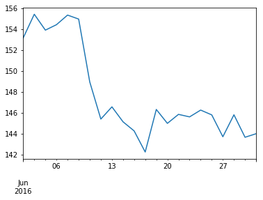

<h1 style="color:blue;" align="center">Pandas Time Series Analysis Tutorial: date_range</h1>


```python
import pandas as pd
```


```python
df = pd.read_csv("aapl_no_dates.csv")
df.head()
```


<div>
<style>
    .dataframe thead tr:only-child th {
        text-align: right;
    }

    .dataframe thead th {
        text-align: left;
    }

    .dataframe tbody tr th {
        vertical-align: top;
    }
</style>
<table border="1" class="dataframe">
  <thead>
    <tr style="text-align: right;">
      <th></th>
      <th>Open</th>
      <th>High</th>
      <th>Low</th>
      <th>Close</th>
      <th>Volume</th>
    </tr>
  </thead>
  <tbody>
    <tr>
      <th>0</th>
      <td>153.17</td>
      <td>153.33</td>
      <td>152.22</td>
      <td>153.18</td>
      <td>16404088</td>
    </tr>
    <tr>
      <th>1</th>
      <td>153.58</td>
      <td>155.45</td>
      <td>152.89</td>
      <td>155.45</td>
      <td>27770715</td>
    </tr>
    <tr>
      <th>2</th>
      <td>154.34</td>
      <td>154.45</td>
      <td>153.46</td>
      <td>153.93</td>
      <td>25331662</td>
    </tr>
    <tr>
      <th>3</th>
      <td>153.90</td>
      <td>155.81</td>
      <td>153.78</td>
      <td>154.45</td>
      <td>26624926</td>
    </tr>
    <tr>
      <th>4</th>
      <td>155.02</td>
      <td>155.98</td>
      <td>154.48</td>
      <td>155.37</td>
      <td>21069647</td>
    </tr>
  </tbody>
</table>
</div>


```python
rng = pd.date_range(start="6/1/2016",end="6/30/2016",freq='B')
rng
```


    DatetimeIndex(['2016-06-01', '2016-06-02', '2016-06-03', '2016-06-06',
                   '2016-06-07', '2016-06-08', '2016-06-09', '2016-06-10',
                   '2016-06-13', '2016-06-14', '2016-06-15', '2016-06-16',
                   '2016-06-17', '2016-06-20', '2016-06-21', '2016-06-22',
                   '2016-06-23', '2016-06-24', '2016-06-27', '2016-06-28',
                   '2016-06-29', '2016-06-30'],
                  dtype='datetime64[ns]', freq='B')


```python
df.set_index(rng, inplace=True)
df.head()
```


<div>
<style>
    .dataframe thead tr:only-child th {
        text-align: right;
    }

    .dataframe thead th {
        text-align: left;
    }

    .dataframe tbody tr th {
        vertical-align: top;
    }
</style>
<table border="1" class="dataframe">
  <thead>
    <tr style="text-align: right;">
      <th></th>
      <th>Open</th>
      <th>High</th>
      <th>Low</th>
      <th>Close</th>
      <th>Volume</th>
    </tr>
  </thead>
  <tbody>
    <tr>
      <th>2016-06-01</th>
      <td>153.17</td>
      <td>153.33</td>
      <td>152.22</td>
      <td>153.18</td>
      <td>16404088</td>
    </tr>
    <tr>
      <th>2016-06-02</th>
      <td>153.58</td>
      <td>155.45</td>
      <td>152.89</td>
      <td>155.45</td>
      <td>27770715</td>
    </tr>
    <tr>
      <th>2016-06-03</th>
      <td>154.34</td>
      <td>154.45</td>
      <td>153.46</td>
      <td>153.93</td>
      <td>25331662</td>
    </tr>
    <tr>
      <th>2016-06-06</th>
      <td>153.90</td>
      <td>155.81</td>
      <td>153.78</td>
      <td>154.45</td>
      <td>26624926</td>
    </tr>
    <tr>
      <th>2016-06-07</th>
      <td>155.02</td>
      <td>155.98</td>
      <td>154.48</td>
      <td>155.37</td>
      <td>21069647</td>
    </tr>
  </tbody>
</table>
</div>


<h3 style="color:purple">Finding missing dates from datetimeindex</h3>


```python
daily_index = pd.date_range(start="6/1/2016",end="6/30/2016",freq='D')
daily_index
```


    DatetimeIndex(['2016-06-01', '2016-06-02', '2016-06-03', '2016-06-04',
                   '2016-06-05', '2016-06-06', '2016-06-07', '2016-06-08',
                   '2016-06-09', '2016-06-10', '2016-06-11', '2016-06-12',
                   '2016-06-13', '2016-06-14', '2016-06-15', '2016-06-16',
                   '2016-06-17', '2016-06-18', '2016-06-19', '2016-06-20',
                   '2016-06-21', '2016-06-22', '2016-06-23', '2016-06-24',
                   '2016-06-25', '2016-06-26', '2016-06-27', '2016-06-28',
                   '2016-06-29', '2016-06-30'],
                  dtype='datetime64[ns]', freq='D')


```python
daily_index.difference(df.index)
```


    DatetimeIndex(['2016-06-04', '2016-06-05', '2016-06-11', '2016-06-12',
                   '2016-06-18', '2016-06-19', '2016-06-25', '2016-06-26'],
                  dtype='datetime64[ns]', freq=None)


<h3 style="color:purple">Benefits of having DatetimeIndex</h3>


```python
%matplotlib inline
df.Close.plot()
```


    <matplotlib.axes._subplots.AxesSubplot at 0x1b5d2a2ffd0>





```python
df["2016-06-01":"2016-06-10"].Close.mean()
```


    152.72125


<h3 style="color:purple">asfreq</h3>


```python
df.index
```


    DatetimeIndex(['2016-06-01', '2016-06-02', '2016-06-03', '2016-06-06',
                   '2016-06-07', '2016-06-08', '2016-06-09', '2016-06-10',
                   '2016-06-13', '2016-06-14', '2016-06-15', '2016-06-16',
                   '2016-06-17', '2016-06-20', '2016-06-21', '2016-06-22',
                   '2016-06-23', '2016-06-24', '2016-06-27', '2016-06-28',
                   '2016-06-29', '2016-06-30'],
                  dtype='datetime64[ns]', freq='B')


```python
df.asfreq('D',method='pad')
```


<div>
<style>
    .dataframe thead tr:only-child th {
        text-align: right;
    }

    .dataframe thead th {
        text-align: left;
    }

    .dataframe tbody tr th {
        vertical-align: top;
    }
</style>
<table border="1" class="dataframe">
  <thead>
    <tr style="text-align: right;">
      <th></th>
      <th>Open</th>
      <th>High</th>
      <th>Low</th>
      <th>Close</th>
      <th>Volume</th>
    </tr>
  </thead>
  <tbody>
    <tr>
      <th>2016-06-01</th>
      <td>153.17</td>
      <td>153.33</td>
      <td>152.22</td>
      <td>153.18</td>
      <td>16404088</td>
    </tr>
    <tr>
      <th>2016-06-02</th>
      <td>153.58</td>
      <td>155.45</td>
      <td>152.89</td>
      <td>155.45</td>
      <td>27770715</td>
    </tr>
    <tr>
      <th>2016-06-03</th>
      <td>154.34</td>
      <td>154.45</td>
      <td>153.46</td>
      <td>153.93</td>
      <td>25331662</td>
    </tr>
    <tr>
      <th>2016-06-04</th>
      <td>154.34</td>
      <td>154.45</td>
      <td>153.46</td>
      <td>153.93</td>
      <td>25331662</td>
    </tr>
    <tr>
      <th>2016-06-05</th>
      <td>154.34</td>
      <td>154.45</td>
      <td>153.46</td>
      <td>153.93</td>
      <td>25331662</td>
    </tr>
    <tr>
      <th>2016-06-06</th>
      <td>153.90</td>
      <td>155.81</td>
      <td>153.78</td>
      <td>154.45</td>
      <td>26624926</td>
    </tr>
    <tr>
      <th>2016-06-07</th>
      <td>155.02</td>
      <td>155.98</td>
      <td>154.48</td>
      <td>155.37</td>
      <td>21069647</td>
    </tr>
    <tr>
      <th>2016-06-08</th>
      <td>155.25</td>
      <td>155.54</td>
      <td>154.40</td>
      <td>154.99</td>
      <td>21250798</td>
    </tr>
    <tr>
      <th>2016-06-09</th>
      <td>155.19</td>
      <td>155.19</td>
      <td>146.02</td>
      <td>148.98</td>
      <td>64882657</td>
    </tr>
    <tr>
      <th>2016-06-10</th>
      <td>145.74</td>
      <td>146.09</td>
      <td>142.51</td>
      <td>145.42</td>
      <td>72307330</td>
    </tr>
    <tr>
      <th>2016-06-11</th>
      <td>145.74</td>
      <td>146.09</td>
      <td>142.51</td>
      <td>145.42</td>
      <td>72307330</td>
    </tr>
    <tr>
      <th>2016-06-12</th>
      <td>145.74</td>
      <td>146.09</td>
      <td>142.51</td>
      <td>145.42</td>
      <td>72307330</td>
    </tr>
    <tr>
      <th>2016-06-13</th>
      <td>147.16</td>
      <td>147.45</td>
      <td>145.15</td>
      <td>146.59</td>
      <td>34165445</td>
    </tr>
    <tr>
      <th>2016-06-14</th>
      <td>147.50</td>
      <td>147.50</td>
      <td>143.84</td>
      <td>145.16</td>
      <td>31531232</td>
    </tr>
    <tr>
      <th>2016-06-15</th>
      <td>143.32</td>
      <td>144.48</td>
      <td>142.21</td>
      <td>144.29</td>
      <td>32165373</td>
    </tr>
    <tr>
      <th>2016-06-16</th>
      <td>143.78</td>
      <td>144.50</td>
      <td>142.20</td>
      <td>142.27</td>
      <td>50361093</td>
    </tr>
    <tr>
      <th>2016-06-17</th>
      <td>143.66</td>
      <td>146.74</td>
      <td>143.66</td>
      <td>146.34</td>
      <td>32541404</td>
    </tr>
    <tr>
      <th>2016-06-18</th>
      <td>143.66</td>
      <td>146.74</td>
      <td>143.66</td>
      <td>146.34</td>
      <td>32541404</td>
    </tr>
    <tr>
      <th>2016-06-19</th>
      <td>143.66</td>
      <td>146.74</td>
      <td>143.66</td>
      <td>146.34</td>
      <td>32541404</td>
    </tr>
    <tr>
      <th>2016-06-20</th>
      <td>146.87</td>
      <td>146.87</td>
      <td>144.94</td>
      <td>145.01</td>
      <td>24900073</td>
    </tr>
    <tr>
      <th>2016-06-21</th>
      <td>145.52</td>
      <td>146.07</td>
      <td>144.61</td>
      <td>145.87</td>
      <td>21265751</td>
    </tr>
    <tr>
      <th>2016-06-22</th>
      <td>145.77</td>
      <td>146.70</td>
      <td>145.12</td>
      <td>145.63</td>
      <td>19106294</td>
    </tr>
    <tr>
      <th>2016-06-23</th>
      <td>145.13</td>
      <td>147.16</td>
      <td>145.11</td>
      <td>146.28</td>
      <td>35439389</td>
    </tr>
    <tr>
      <th>2016-06-24</th>
      <td>147.17</td>
      <td>148.28</td>
      <td>145.38</td>
      <td>145.82</td>
      <td>25692361</td>
    </tr>
    <tr>
      <th>2016-06-25</th>
      <td>147.17</td>
      <td>148.28</td>
      <td>145.38</td>
      <td>145.82</td>
      <td>25692361</td>
    </tr>
    <tr>
      <th>2016-06-26</th>
      <td>147.17</td>
      <td>148.28</td>
      <td>145.38</td>
      <td>145.82</td>
      <td>25692361</td>
    </tr>
    <tr>
      <th>2016-06-27</th>
      <td>145.01</td>
      <td>146.16</td>
      <td>143.62</td>
      <td>143.73</td>
      <td>24761891</td>
    </tr>
    <tr>
      <th>2016-06-28</th>
      <td>144.49</td>
      <td>146.11</td>
      <td>143.16</td>
      <td>145.83</td>
      <td>22082432</td>
    </tr>
    <tr>
      <th>2016-06-29</th>
      <td>144.71</td>
      <td>145.13</td>
      <td>142.28</td>
      <td>143.68</td>
      <td>31499368</td>
    </tr>
    <tr>
      <th>2016-06-30</th>
      <td>144.45</td>
      <td>144.96</td>
      <td>143.78</td>
      <td>144.02</td>
      <td>23024107</td>
    </tr>
  </tbody>
</table>
</div>


```python
df.asfreq('W',method='pad')
```


<div>
<style>
    .dataframe thead tr:only-child th {
        text-align: right;
    }

    .dataframe thead th {
        text-align: left;
    }

    .dataframe tbody tr th {
        vertical-align: top;
    }
</style>
<table border="1" class="dataframe">
  <thead>
    <tr style="text-align: right;">
      <th></th>
      <th>Open</th>
      <th>High</th>
      <th>Low</th>
      <th>Close</th>
      <th>Volume</th>
    </tr>
  </thead>
  <tbody>
    <tr>
      <th>2016-06-05</th>
      <td>154.34</td>
      <td>154.45</td>
      <td>153.46</td>
      <td>153.93</td>
      <td>25331662</td>
    </tr>
    <tr>
      <th>2016-06-12</th>
      <td>145.74</td>
      <td>146.09</td>
      <td>142.51</td>
      <td>145.42</td>
      <td>72307330</td>
    </tr>
    <tr>
      <th>2016-06-19</th>
      <td>143.66</td>
      <td>146.74</td>
      <td>143.66</td>
      <td>146.34</td>
      <td>32541404</td>
    </tr>
    <tr>
      <th>2016-06-26</th>
      <td>147.17</td>
      <td>148.28</td>
      <td>145.38</td>
      <td>145.82</td>
      <td>25692361</td>
    </tr>
  </tbody>
</table>
</div>


```python
df.asfreq('H',method='pad')
```


<div>
<style>
    .dataframe thead tr:only-child th {
        text-align: right;
    }

    .dataframe thead th {
        text-align: left;
    }

    .dataframe tbody tr th {
        vertical-align: top;
    }
</style>
<table border="1" class="dataframe">
  <thead>
    <tr style="text-align: right;">
      <th></th>
      <th>Open</th>
      <th>High</th>
      <th>Low</th>
      <th>Close</th>
      <th>Volume</th>
    </tr>
  </thead>
  <tbody>
    <tr>
      <th>2016-06-01 00:00:00</th>
      <td>153.17</td>
      <td>153.33</td>
      <td>152.22</td>
      <td>153.18</td>
      <td>16404088</td>
    </tr>
    <tr>
      <th>2016-06-01 01:00:00</th>
      <td>153.17</td>
      <td>153.33</td>
      <td>152.22</td>
      <td>153.18</td>
      <td>16404088</td>
    </tr>
    <tr>
      <th>2016-06-01 02:00:00</th>
      <td>153.17</td>
      <td>153.33</td>
      <td>152.22</td>
      <td>153.18</td>
      <td>16404088</td>
    </tr>
    <tr>
      <th>2016-06-01 03:00:00</th>
      <td>153.17</td>
      <td>153.33</td>
      <td>152.22</td>
      <td>153.18</td>
      <td>16404088</td>
    </tr>
    <tr>
      <th>2016-06-01 04:00:00</th>
      <td>153.17</td>
      <td>153.33</td>
      <td>152.22</td>
      <td>153.18</td>
      <td>16404088</td>
    </tr>
    <tr>
      <th>2016-06-01 05:00:00</th>
      <td>153.17</td>
      <td>153.33</td>
      <td>152.22</td>
      <td>153.18</td>
      <td>16404088</td>
    </tr>
    <tr>
      <th>2016-06-01 06:00:00</th>
      <td>153.17</td>
      <td>153.33</td>
      <td>152.22</td>
      <td>153.18</td>
      <td>16404088</td>
    </tr>
    <tr>
      <th>2016-06-01 07:00:00</th>
      <td>153.17</td>
      <td>153.33</td>
      <td>152.22</td>
      <td>153.18</td>
      <td>16404088</td>
    </tr>
    <tr>
      <th>2016-06-01 08:00:00</th>
      <td>153.17</td>
      <td>153.33</td>
      <td>152.22</td>
      <td>153.18</td>
      <td>16404088</td>
    </tr>
    <tr>
      <th>2016-06-01 09:00:00</th>
      <td>153.17</td>
      <td>153.33</td>
      <td>152.22</td>
      <td>153.18</td>
      <td>16404088</td>
    </tr>
    <tr>
      <th>2016-06-01 10:00:00</th>
      <td>153.17</td>
      <td>153.33</td>
      <td>152.22</td>
      <td>153.18</td>
      <td>16404088</td>
    </tr>
    <tr>
      <th>2016-06-01 11:00:00</th>
      <td>153.17</td>
      <td>153.33</td>
      <td>152.22</td>
      <td>153.18</td>
      <td>16404088</td>
    </tr>
    <tr>
      <th>2016-06-01 12:00:00</th>
      <td>153.17</td>
      <td>153.33</td>
      <td>152.22</td>
      <td>153.18</td>
      <td>16404088</td>
    </tr>
    <tr>
      <th>2016-06-01 13:00:00</th>
      <td>153.17</td>
      <td>153.33</td>
      <td>152.22</td>
      <td>153.18</td>
      <td>16404088</td>
    </tr>
    <tr>
      <th>2016-06-01 14:00:00</th>
      <td>153.17</td>
      <td>153.33</td>
      <td>152.22</td>
      <td>153.18</td>
      <td>16404088</td>
    </tr>
    <tr>
      <th>2016-06-01 15:00:00</th>
      <td>153.17</td>
      <td>153.33</td>
      <td>152.22</td>
      <td>153.18</td>
      <td>16404088</td>
    </tr>
    <tr>
      <th>2016-06-01 16:00:00</th>
      <td>153.17</td>
      <td>153.33</td>
      <td>152.22</td>
      <td>153.18</td>
      <td>16404088</td>
    </tr>
    <tr>
      <th>2016-06-01 17:00:00</th>
      <td>153.17</td>
      <td>153.33</td>
      <td>152.22</td>
      <td>153.18</td>
      <td>16404088</td>
    </tr>
    <tr>
      <th>2016-06-01 18:00:00</th>
      <td>153.17</td>
      <td>153.33</td>
      <td>152.22</td>
      <td>153.18</td>
      <td>16404088</td>
    </tr>
    <tr>
      <th>2016-06-01 19:00:00</th>
      <td>153.17</td>
      <td>153.33</td>
      <td>152.22</td>
      <td>153.18</td>
      <td>16404088</td>
    </tr>
    <tr>
      <th>2016-06-01 20:00:00</th>
      <td>153.17</td>
      <td>153.33</td>
      <td>152.22</td>
      <td>153.18</td>
      <td>16404088</td>
    </tr>
    <tr>
      <th>2016-06-01 21:00:00</th>
      <td>153.17</td>
      <td>153.33</td>
      <td>152.22</td>
      <td>153.18</td>
      <td>16404088</td>
    </tr>
    <tr>
      <th>2016-06-01 22:00:00</th>
      <td>153.17</td>
      <td>153.33</td>
      <td>152.22</td>
      <td>153.18</td>
      <td>16404088</td>
    </tr>
    <tr>
      <th>2016-06-01 23:00:00</th>
      <td>153.17</td>
      <td>153.33</td>
      <td>152.22</td>
      <td>153.18</td>
      <td>16404088</td>
    </tr>
    <tr>
      <th>2016-06-02 00:00:00</th>
      <td>153.58</td>
      <td>155.45</td>
      <td>152.89</td>
      <td>155.45</td>
      <td>27770715</td>
    </tr>
    <tr>
      <th>2016-06-02 01:00:00</th>
      <td>153.58</td>
      <td>155.45</td>
      <td>152.89</td>
      <td>155.45</td>
      <td>27770715</td>
    </tr>
    <tr>
      <th>2016-06-02 02:00:00</th>
      <td>153.58</td>
      <td>155.45</td>
      <td>152.89</td>
      <td>155.45</td>
      <td>27770715</td>
    </tr>
    <tr>
      <th>2016-06-02 03:00:00</th>
      <td>153.58</td>
      <td>155.45</td>
      <td>152.89</td>
      <td>155.45</td>
      <td>27770715</td>
    </tr>
    <tr>
      <th>2016-06-02 04:00:00</th>
      <td>153.58</td>
      <td>155.45</td>
      <td>152.89</td>
      <td>155.45</td>
      <td>27770715</td>
    </tr>
    <tr>
      <th>2016-06-02 05:00:00</th>
      <td>153.58</td>
      <td>155.45</td>
      <td>152.89</td>
      <td>155.45</td>
      <td>27770715</td>
    </tr>
    <tr>
      <th>...</th>
      <td>...</td>
      <td>...</td>
      <td>...</td>
      <td>...</td>
      <td>...</td>
    </tr>
    <tr>
      <th>2016-06-28 19:00:00</th>
      <td>144.49</td>
      <td>146.11</td>
      <td>143.16</td>
      <td>145.83</td>
      <td>22082432</td>
    </tr>
    <tr>
      <th>2016-06-28 20:00:00</th>
      <td>144.49</td>
      <td>146.11</td>
      <td>143.16</td>
      <td>145.83</td>
      <td>22082432</td>
    </tr>
    <tr>
      <th>2016-06-28 21:00:00</th>
      <td>144.49</td>
      <td>146.11</td>
      <td>143.16</td>
      <td>145.83</td>
      <td>22082432</td>
    </tr>
    <tr>
      <th>2016-06-28 22:00:00</th>
      <td>144.49</td>
      <td>146.11</td>
      <td>143.16</td>
      <td>145.83</td>
      <td>22082432</td>
    </tr>
    <tr>
      <th>2016-06-28 23:00:00</th>
      <td>144.49</td>
      <td>146.11</td>
      <td>143.16</td>
      <td>145.83</td>
      <td>22082432</td>
    </tr>
    <tr>
      <th>2016-06-29 00:00:00</th>
      <td>144.71</td>
      <td>145.13</td>
      <td>142.28</td>
      <td>143.68</td>
      <td>31499368</td>
    </tr>
    <tr>
      <th>2016-06-29 01:00:00</th>
      <td>144.71</td>
      <td>145.13</td>
      <td>142.28</td>
      <td>143.68</td>
      <td>31499368</td>
    </tr>
    <tr>
      <th>2016-06-29 02:00:00</th>
      <td>144.71</td>
      <td>145.13</td>
      <td>142.28</td>
      <td>143.68</td>
      <td>31499368</td>
    </tr>
    <tr>
      <th>2016-06-29 03:00:00</th>
      <td>144.71</td>
      <td>145.13</td>
      <td>142.28</td>
      <td>143.68</td>
      <td>31499368</td>
    </tr>
    <tr>
      <th>2016-06-29 04:00:00</th>
      <td>144.71</td>
      <td>145.13</td>
      <td>142.28</td>
      <td>143.68</td>
      <td>31499368</td>
    </tr>
    <tr>
      <th>2016-06-29 05:00:00</th>
      <td>144.71</td>
      <td>145.13</td>
      <td>142.28</td>
      <td>143.68</td>
      <td>31499368</td>
    </tr>
    <tr>
      <th>2016-06-29 06:00:00</th>
      <td>144.71</td>
      <td>145.13</td>
      <td>142.28</td>
      <td>143.68</td>
      <td>31499368</td>
    </tr>
    <tr>
      <th>2016-06-29 07:00:00</th>
      <td>144.71</td>
      <td>145.13</td>
      <td>142.28</td>
      <td>143.68</td>
      <td>31499368</td>
    </tr>
    <tr>
      <th>2016-06-29 08:00:00</th>
      <td>144.71</td>
      <td>145.13</td>
      <td>142.28</td>
      <td>143.68</td>
      <td>31499368</td>
    </tr>
    <tr>
      <th>2016-06-29 09:00:00</th>
      <td>144.71</td>
      <td>145.13</td>
      <td>142.28</td>
      <td>143.68</td>
      <td>31499368</td>
    </tr>
    <tr>
      <th>2016-06-29 10:00:00</th>
      <td>144.71</td>
      <td>145.13</td>
      <td>142.28</td>
      <td>143.68</td>
      <td>31499368</td>
    </tr>
    <tr>
      <th>2016-06-29 11:00:00</th>
      <td>144.71</td>
      <td>145.13</td>
      <td>142.28</td>
      <td>143.68</td>
      <td>31499368</td>
    </tr>
    <tr>
      <th>2016-06-29 12:00:00</th>
      <td>144.71</td>
      <td>145.13</td>
      <td>142.28</td>
      <td>143.68</td>
      <td>31499368</td>
    </tr>
    <tr>
      <th>2016-06-29 13:00:00</th>
      <td>144.71</td>
      <td>145.13</td>
      <td>142.28</td>
      <td>143.68</td>
      <td>31499368</td>
    </tr>
    <tr>
      <th>2016-06-29 14:00:00</th>
      <td>144.71</td>
      <td>145.13</td>
      <td>142.28</td>
      <td>143.68</td>
      <td>31499368</td>
    </tr>
    <tr>
      <th>2016-06-29 15:00:00</th>
      <td>144.71</td>
      <td>145.13</td>
      <td>142.28</td>
      <td>143.68</td>
      <td>31499368</td>
    </tr>
    <tr>
      <th>2016-06-29 16:00:00</th>
      <td>144.71</td>
      <td>145.13</td>
      <td>142.28</td>
      <td>143.68</td>
      <td>31499368</td>
    </tr>
    <tr>
      <th>2016-06-29 17:00:00</th>
      <td>144.71</td>
      <td>145.13</td>
      <td>142.28</td>
      <td>143.68</td>
      <td>31499368</td>
    </tr>
    <tr>
      <th>2016-06-29 18:00:00</th>
      <td>144.71</td>
      <td>145.13</td>
      <td>142.28</td>
      <td>143.68</td>
      <td>31499368</td>
    </tr>
    <tr>
      <th>2016-06-29 19:00:00</th>
      <td>144.71</td>
      <td>145.13</td>
      <td>142.28</td>
      <td>143.68</td>
      <td>31499368</td>
    </tr>
    <tr>
      <th>2016-06-29 20:00:00</th>
      <td>144.71</td>
      <td>145.13</td>
      <td>142.28</td>
      <td>143.68</td>
      <td>31499368</td>
    </tr>
    <tr>
      <th>2016-06-29 21:00:00</th>
      <td>144.71</td>
      <td>145.13</td>
      <td>142.28</td>
      <td>143.68</td>
      <td>31499368</td>
    </tr>
    <tr>
      <th>2016-06-29 22:00:00</th>
      <td>144.71</td>
      <td>145.13</td>
      <td>142.28</td>
      <td>143.68</td>
      <td>31499368</td>
    </tr>
    <tr>
      <th>2016-06-29 23:00:00</th>
      <td>144.71</td>
      <td>145.13</td>
      <td>142.28</td>
      <td>143.68</td>
      <td>31499368</td>
    </tr>
    <tr>
      <th>2016-06-30 00:00:00</th>
      <td>144.45</td>
      <td>144.96</td>
      <td>143.78</td>
      <td>144.02</td>
      <td>23024107</td>
    </tr>
  </tbody>
</table>
<p>697 rows × 5 columns</p>
</div>


<h3 style="color:purple"> generating DatetimeIndex with periods argument</h3>


```python
rng = pd.date_range('1/1/2011', periods=72, freq='H')
rng
```


    DatetimeIndex(['2011-01-01 00:00:00', '2011-01-01 01:00:00',
                   '2011-01-01 02:00:00', '2011-01-01 03:00:00',
                   '2011-01-01 04:00:00', '2011-01-01 05:00:00',
                   '2011-01-01 06:00:00', '2011-01-01 07:00:00',
                   '2011-01-01 08:00:00', '2011-01-01 09:00:00',
                   '2011-01-01 10:00:00', '2011-01-01 11:00:00',
                   '2011-01-01 12:00:00', '2011-01-01 13:00:00',
                   '2011-01-01 14:00:00', '2011-01-01 15:00:00',
                   '2011-01-01 16:00:00', '2011-01-01 17:00:00',
                   '2011-01-01 18:00:00', '2011-01-01 19:00:00',
                   '2011-01-01 20:00:00', '2011-01-01 21:00:00',
                   '2011-01-01 22:00:00', '2011-01-01 23:00:00',
                   '2011-01-02 00:00:00', '2011-01-02 01:00:00',
                   '2011-01-02 02:00:00', '2011-01-02 03:00:00',
                   '2011-01-02 04:00:00', '2011-01-02 05:00:00',
                   '2011-01-02 06:00:00', '2011-01-02 07:00:00',
                   '2011-01-02 08:00:00', '2011-01-02 09:00:00',
                   '2011-01-02 10:00:00', '2011-01-02 11:00:00',
                   '2011-01-02 12:00:00', '2011-01-02 13:00:00',
                   '2011-01-02 14:00:00', '2011-01-02 15:00:00',
                   '2011-01-02 16:00:00', '2011-01-02 17:00:00',
                   '2011-01-02 18:00:00', '2011-01-02 19:00:00',
                   '2011-01-02 20:00:00', '2011-01-02 21:00:00',
                   '2011-01-02 22:00:00', '2011-01-02 23:00:00',
                   '2011-01-03 00:00:00', '2011-01-03 01:00:00',
                   '2011-01-03 02:00:00', '2011-01-03 03:00:00',
                   '2011-01-03 04:00:00', '2011-01-03 05:00:00',
                   '2011-01-03 06:00:00', '2011-01-03 07:00:00',
                   '2011-01-03 08:00:00', '2011-01-03 09:00:00',
                   '2011-01-03 10:00:00', '2011-01-03 11:00:00',
                   '2011-01-03 12:00:00', '2011-01-03 13:00:00',
                   '2011-01-03 14:00:00', '2011-01-03 15:00:00',
                   '2011-01-03 16:00:00', '2011-01-03 17:00:00',
                   '2011-01-03 18:00:00', '2011-01-03 19:00:00',
                   '2011-01-03 20:00:00', '2011-01-03 21:00:00',
                   '2011-01-03 22:00:00', '2011-01-03 23:00:00'],
                  dtype='datetime64[ns]', freq='H')


```python
import numpy as np
ts = pd.Series(np.random.randint(0,10,len(rng)), index=rng)
ts.head(20)
```


    2011-01-01 00:00:00    9
    2011-01-01 01:00:00    0
    2011-01-01 02:00:00    3
    2011-01-01 03:00:00    5
    2011-01-01 04:00:00    9
    2011-01-01 05:00:00    6
    2011-01-01 06:00:00    1
    2011-01-01 07:00:00    9
    2011-01-01 08:00:00    2
    2011-01-01 09:00:00    5
    2011-01-01 10:00:00    0
    2011-01-01 11:00:00    6
    2011-01-01 12:00:00    2
    2011-01-01 13:00:00    3
    2011-01-01 14:00:00    1
    2011-01-01 15:00:00    3
    2011-01-01 16:00:00    1
    2011-01-01 17:00:00    8
    2011-01-01 18:00:00    5
    2011-01-01 19:00:00    2
    Freq: H, dtype: int32


