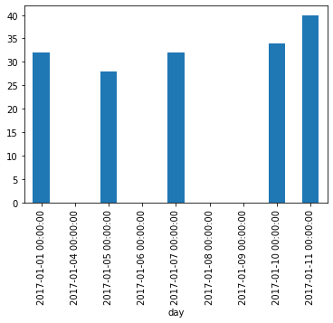

```python
import pandas as pd
df = pd.read_csv("weather_data.csv", parse_dates=["day"])
df.set_index('day',inplace=True)
df
```


<div>
<style scoped>
    .dataframe tbody tr th:only-of-type {
        vertical-align: middle;
    }

    .dataframe tbody tr th {
        vertical-align: top;
    }

    .dataframe thead th {
        text-align: right;
    }
</style>
<table border="1" class="dataframe">
  <thead>
    <tr style="text-align: right;">
      <th></th>
      <th>temperature</th>
      <th>windspeed</th>
      <th>event</th>
    </tr>
    <tr>
      <th>day</th>
      <th></th>
      <th></th>
      <th></th>
    </tr>
  </thead>
  <tbody>
    <tr>
      <th>2017-01-01</th>
      <td>32.0</td>
      <td>6.0</td>
      <td>Rain</td>
    </tr>
    <tr>
      <th>2017-01-04</th>
      <td>NaN</td>
      <td>9.0</td>
      <td>Sunny</td>
    </tr>
    <tr>
      <th>2017-01-05</th>
      <td>28.0</td>
      <td>NaN</td>
      <td>Snow</td>
    </tr>
    <tr>
      <th>2017-01-06</th>
      <td>NaN</td>
      <td>7.0</td>
      <td>NaN</td>
    </tr>
    <tr>
      <th>2017-01-07</th>
      <td>32.0</td>
      <td>NaN</td>
      <td>Rain</td>
    </tr>
    <tr>
      <th>2017-01-08</th>
      <td>NaN</td>
      <td>NaN</td>
      <td>Sunny</td>
    </tr>
    <tr>
      <th>2017-01-09</th>
      <td>NaN</td>
      <td>NaN</td>
      <td>NaN</td>
    </tr>
    <tr>
      <th>2017-01-10</th>
      <td>34.0</td>
      <td>8.0</td>
      <td>Cloudy</td>
    </tr>
    <tr>
      <th>2017-01-11</th>
      <td>40.0</td>
      <td>12.0</td>
      <td>Sunny</td>
    </tr>
  </tbody>
</table>
</div>


```python
%matplotlib inline
df.temperature.plot.bar()
```


    <matplotlib.axes._subplots.AxesSubplot at 0x16ee665de80>





```python
new_df = df.fillna({
        'temperature': 0,
        'windspeed': 0,
        'event': 'no event'
    })
new_df
```


<div>
<style scoped>
    .dataframe tbody tr th:only-of-type {
        vertical-align: middle;
    }

    .dataframe tbody tr th {
        vertical-align: top;
    }

    .dataframe thead th {
        text-align: right;
    }
</style>
<table border="1" class="dataframe">
  <thead>
    <tr style="text-align: right;">
      <th></th>
      <th>temperature</th>
      <th>windspeed</th>
      <th>event</th>
    </tr>
    <tr>
      <th>day</th>
      <th></th>
      <th></th>
      <th></th>
    </tr>
  </thead>
  <tbody>
    <tr>
      <th>2017-01-01</th>
      <td>32.0</td>
      <td>6.0</td>
      <td>Rain</td>
    </tr>
    <tr>
      <th>2017-01-04</th>
      <td>0.0</td>
      <td>9.0</td>
      <td>Sunny</td>
    </tr>
    <tr>
      <th>2017-01-05</th>
      <td>28.0</td>
      <td>0.0</td>
      <td>Snow</td>
    </tr>
    <tr>
      <th>2017-01-06</th>
      <td>0.0</td>
      <td>7.0</td>
      <td>no event</td>
    </tr>
    <tr>
      <th>2017-01-07</th>
      <td>32.0</td>
      <td>0.0</td>
      <td>Rain</td>
    </tr>
    <tr>
      <th>2017-01-08</th>
      <td>0.0</td>
      <td>0.0</td>
      <td>Sunny</td>
    </tr>
    <tr>
      <th>2017-01-09</th>
      <td>0.0</td>
      <td>0.0</td>
      <td>no event</td>
    </tr>
    <tr>
      <th>2017-01-10</th>
      <td>34.0</td>
      <td>8.0</td>
      <td>Cloudy</td>
    </tr>
    <tr>
      <th>2017-01-11</th>
      <td>40.0</td>
      <td>12.0</td>
      <td>Sunny</td>
    </tr>
  </tbody>
</table>
</div>


```python
new_df = df.fillna(0)
new_df
```


<div>
<style scoped>
    .dataframe tbody tr th:only-of-type {
        vertical-align: middle;
    }

    .dataframe tbody tr th {
        vertical-align: top;
    }

    .dataframe thead th {
        text-align: right;
    }
</style>
<table border="1" class="dataframe">
  <thead>
    <tr style="text-align: right;">
      <th></th>
      <th>temperature</th>
      <th>windspeed</th>
      <th>event</th>
    </tr>
  </thead>
  <tbody>
    <tr>
      <th>2017-01-01</th>
      <td>32.0</td>
      <td>6.0</td>
      <td>Rain</td>
    </tr>
    <tr>
      <th>2017-01-02</th>
      <td>0.0</td>
      <td>0.0</td>
      <td>0</td>
    </tr>
    <tr>
      <th>2017-01-03</th>
      <td>0.0</td>
      <td>0.0</td>
      <td>0</td>
    </tr>
    <tr>
      <th>2017-01-04</th>
      <td>0.0</td>
      <td>9.0</td>
      <td>Sunny</td>
    </tr>
    <tr>
      <th>2017-01-05</th>
      <td>28.0</td>
      <td>0.0</td>
      <td>Snow</td>
    </tr>
    <tr>
      <th>2017-01-06</th>
      <td>0.0</td>
      <td>7.0</td>
      <td>0</td>
    </tr>
    <tr>
      <th>2017-01-07</th>
      <td>32.0</td>
      <td>0.0</td>
      <td>Rain</td>
    </tr>
    <tr>
      <th>2017-01-08</th>
      <td>0.0</td>
      <td>0.0</td>
      <td>Sunny</td>
    </tr>
    <tr>
      <th>2017-01-09</th>
      <td>0.0</td>
      <td>0.0</td>
      <td>0</td>
    </tr>
    <tr>
      <th>2017-01-10</th>
      <td>34.0</td>
      <td>8.0</td>
      <td>Cloudy</td>
    </tr>
    <tr>
      <th>2017-01-11</th>
      <td>40.0</td>
      <td>12.0</td>
      <td>Sunny</td>
    </tr>
  </tbody>
</table>
</div>


```python
new_df = df.fillna(method="ffill")
new_df
```


<div>
<style scoped>
    .dataframe tbody tr th:only-of-type {
        vertical-align: middle;
    }

    .dataframe tbody tr th {
        vertical-align: top;
    }

    .dataframe thead th {
        text-align: right;
    }
</style>
<table border="1" class="dataframe">
  <thead>
    <tr style="text-align: right;">
      <th></th>
      <th>temperature</th>
      <th>windspeed</th>
      <th>event</th>
    </tr>
  </thead>
  <tbody>
    <tr>
      <th>2017-01-01</th>
      <td>32.0</td>
      <td>6.0</td>
      <td>Rain</td>
    </tr>
    <tr>
      <th>2017-01-02</th>
      <td>32.0</td>
      <td>6.0</td>
      <td>Rain</td>
    </tr>
    <tr>
      <th>2017-01-03</th>
      <td>32.0</td>
      <td>6.0</td>
      <td>Rain</td>
    </tr>
    <tr>
      <th>2017-01-04</th>
      <td>32.0</td>
      <td>9.0</td>
      <td>Sunny</td>
    </tr>
    <tr>
      <th>2017-01-05</th>
      <td>28.0</td>
      <td>9.0</td>
      <td>Snow</td>
    </tr>
    <tr>
      <th>2017-01-06</th>
      <td>28.0</td>
      <td>7.0</td>
      <td>Snow</td>
    </tr>
    <tr>
      <th>2017-01-07</th>
      <td>32.0</td>
      <td>7.0</td>
      <td>Rain</td>
    </tr>
    <tr>
      <th>2017-01-08</th>
      <td>32.0</td>
      <td>7.0</td>
      <td>Sunny</td>
    </tr>
    <tr>
      <th>2017-01-09</th>
      <td>32.0</td>
      <td>7.0</td>
      <td>Sunny</td>
    </tr>
    <tr>
      <th>2017-01-10</th>
      <td>34.0</td>
      <td>8.0</td>
      <td>Cloudy</td>
    </tr>
    <tr>
      <th>2017-01-11</th>
      <td>40.0</td>
      <td>12.0</td>
      <td>Sunny</td>
    </tr>
  </tbody>
</table>
</div>


```python
new_df = df.interpolate(method="time")
new_df
```


<div>
<style scoped>
    .dataframe tbody tr th:only-of-type {
        vertical-align: middle;
    }

    .dataframe tbody tr th {
        vertical-align: top;
    }

    .dataframe thead th {
        text-align: right;
    }
</style>
<table border="1" class="dataframe">
  <thead>
    <tr style="text-align: right;">
      <th></th>
      <th>temperature</th>
      <th>windspeed</th>
      <th>event</th>
    </tr>
  </thead>
  <tbody>
    <tr>
      <th>2017-01-01</th>
      <td>32.000000</td>
      <td>6.00</td>
      <td>Rain</td>
    </tr>
    <tr>
      <th>2017-01-02</th>
      <td>31.000000</td>
      <td>7.00</td>
      <td>NaN</td>
    </tr>
    <tr>
      <th>2017-01-03</th>
      <td>30.000000</td>
      <td>8.00</td>
      <td>NaN</td>
    </tr>
    <tr>
      <th>2017-01-04</th>
      <td>29.000000</td>
      <td>9.00</td>
      <td>Sunny</td>
    </tr>
    <tr>
      <th>2017-01-05</th>
      <td>28.000000</td>
      <td>8.00</td>
      <td>Snow</td>
    </tr>
    <tr>
      <th>2017-01-06</th>
      <td>30.000000</td>
      <td>7.00</td>
      <td>NaN</td>
    </tr>
    <tr>
      <th>2017-01-07</th>
      <td>32.000000</td>
      <td>7.25</td>
      <td>Rain</td>
    </tr>
    <tr>
      <th>2017-01-08</th>
      <td>32.666667</td>
      <td>7.50</td>
      <td>Sunny</td>
    </tr>
    <tr>
      <th>2017-01-09</th>
      <td>33.333333</td>
      <td>7.75</td>
      <td>NaN</td>
    </tr>
    <tr>
      <th>2017-01-10</th>
      <td>34.000000</td>
      <td>8.00</td>
      <td>Cloudy</td>
    </tr>
    <tr>
      <th>2017-01-11</th>
      <td>40.000000</td>
      <td>12.00</td>
      <td>Sunny</td>
    </tr>
  </tbody>
</table>
</div>


```python
new_df = df.dropna(thresh=1) # (how="all") 
new_df
```


<div>
<style scoped>
    .dataframe tbody tr th:only-of-type {
        vertical-align: middle;
    }

    .dataframe tbody tr th {
        vertical-align: top;
    }

    .dataframe thead th {
        text-align: right;
    }
</style>
<table border="1" class="dataframe">
  <thead>
    <tr style="text-align: right;">
      <th></th>
      <th>temperature</th>
      <th>windspeed</th>
      <th>event</th>
    </tr>
  </thead>
  <tbody>
    <tr>
      <th>2017-01-01</th>
      <td>32.0</td>
      <td>6.0</td>
      <td>Rain</td>
    </tr>
    <tr>
      <th>2017-01-04</th>
      <td>NaN</td>
      <td>9.0</td>
      <td>Sunny</td>
    </tr>
    <tr>
      <th>2017-01-05</th>
      <td>28.0</td>
      <td>NaN</td>
      <td>Snow</td>
    </tr>
    <tr>
      <th>2017-01-06</th>
      <td>NaN</td>
      <td>7.0</td>
      <td>NaN</td>
    </tr>
    <tr>
      <th>2017-01-07</th>
      <td>32.0</td>
      <td>NaN</td>
      <td>Rain</td>
    </tr>
    <tr>
      <th>2017-01-08</th>
      <td>NaN</td>
      <td>NaN</td>
      <td>Sunny</td>
    </tr>
    <tr>
      <th>2017-01-10</th>
      <td>34.0</td>
      <td>8.0</td>
      <td>Cloudy</td>
    </tr>
    <tr>
      <th>2017-01-11</th>
      <td>40.0</td>
      <td>12.0</td>
      <td>Sunny</td>
    </tr>
  </tbody>
</table>
</div>


```python
dt = pd.date_range("01-01-2017","01-11-2017")
idx = pd.DatetimeIndex(dt)
df = df.reindex(idx)
df
```


<div>
<style scoped>
    .dataframe tbody tr th:only-of-type {
        vertical-align: middle;
    }

    .dataframe tbody tr th {
        vertical-align: top;
    }

    .dataframe thead th {
        text-align: right;
    }
</style>
<table border="1" class="dataframe">
  <thead>
    <tr style="text-align: right;">
      <th></th>
      <th>temperature</th>
      <th>windspeed</th>
      <th>event</th>
    </tr>
  </thead>
  <tbody>
    <tr>
      <th>2017-01-01</th>
      <td>32.0</td>
      <td>6.0</td>
      <td>Rain</td>
    </tr>
    <tr>
      <th>2017-01-02</th>
      <td>NaN</td>
      <td>NaN</td>
      <td>NaN</td>
    </tr>
    <tr>
      <th>2017-01-03</th>
      <td>NaN</td>
      <td>NaN</td>
      <td>NaN</td>
    </tr>
    <tr>
      <th>2017-01-04</th>
      <td>NaN</td>
      <td>9.0</td>
      <td>Sunny</td>
    </tr>
    <tr>
      <th>2017-01-05</th>
      <td>28.0</td>
      <td>NaN</td>
      <td>Snow</td>
    </tr>
    <tr>
      <th>2017-01-06</th>
      <td>NaN</td>
      <td>7.0</td>
      <td>NaN</td>
    </tr>
    <tr>
      <th>2017-01-07</th>
      <td>32.0</td>
      <td>NaN</td>
      <td>Rain</td>
    </tr>
    <tr>
      <th>2017-01-08</th>
      <td>NaN</td>
      <td>NaN</td>
      <td>Sunny</td>
    </tr>
    <tr>
      <th>2017-01-09</th>
      <td>NaN</td>
      <td>NaN</td>
      <td>NaN</td>
    </tr>
    <tr>
      <th>2017-01-10</th>
      <td>34.0</td>
      <td>8.0</td>
      <td>Cloudy</td>
    </tr>
    <tr>
      <th>2017-01-11</th>
      <td>40.0</td>
      <td>12.0</td>
      <td>Sunny</td>
    </tr>
  </tbody>
</table>
</div>


