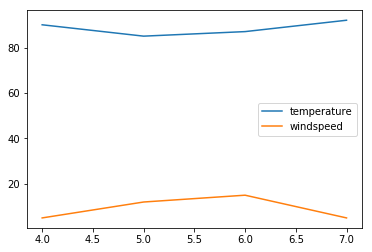
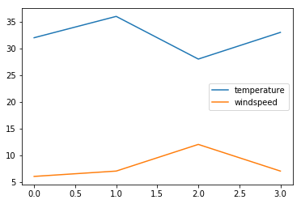
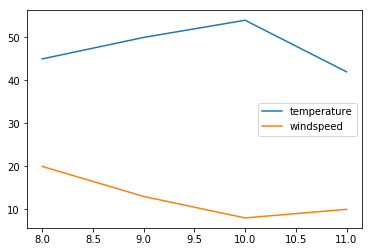

## <font color="maroon"><h4 align="center">Pandas Group By</font>

**In this tutorial we are going to look at weather data from various cities and see how group by can be used to run some analytics.** 


```python
import pandas as pd
df = pd.read_csv("weather_by_cities.csv")
df
```


<div>
<style scoped>
    .dataframe tbody tr th:only-of-type {
        vertical-align: middle;
    }

    .dataframe tbody tr th {
        vertical-align: top;
    }

    .dataframe thead th {
        text-align: right;
    }
</style>
<table border="1" class="dataframe">
  <thead>
    <tr style="text-align: right;">
      <th></th>
      <th>day</th>
      <th>city</th>
      <th>temperature</th>
      <th>windspeed</th>
      <th>event</th>
    </tr>
  </thead>
  <tbody>
    <tr>
      <th>0</th>
      <td>1/1/2017</td>
      <td>new york</td>
      <td>32</td>
      <td>6</td>
      <td>Rain</td>
    </tr>
    <tr>
      <th>1</th>
      <td>1/2/2017</td>
      <td>new york</td>
      <td>36</td>
      <td>7</td>
      <td>Sunny</td>
    </tr>
    <tr>
      <th>2</th>
      <td>1/3/2017</td>
      <td>new york</td>
      <td>28</td>
      <td>12</td>
      <td>Snow</td>
    </tr>
    <tr>
      <th>3</th>
      <td>1/4/2017</td>
      <td>new york</td>
      <td>33</td>
      <td>7</td>
      <td>Sunny</td>
    </tr>
    <tr>
      <th>4</th>
      <td>1/1/2017</td>
      <td>mumbai</td>
      <td>90</td>
      <td>5</td>
      <td>Sunny</td>
    </tr>
    <tr>
      <th>5</th>
      <td>1/2/2017</td>
      <td>mumbai</td>
      <td>85</td>
      <td>12</td>
      <td>Fog</td>
    </tr>
    <tr>
      <th>6</th>
      <td>1/3/2017</td>
      <td>mumbai</td>
      <td>87</td>
      <td>15</td>
      <td>Fog</td>
    </tr>
    <tr>
      <th>7</th>
      <td>1/4/2017</td>
      <td>mumbai</td>
      <td>92</td>
      <td>5</td>
      <td>Rain</td>
    </tr>
    <tr>
      <th>8</th>
      <td>1/1/2017</td>
      <td>paris</td>
      <td>45</td>
      <td>20</td>
      <td>Sunny</td>
    </tr>
    <tr>
      <th>9</th>
      <td>1/2/2017</td>
      <td>paris</td>
      <td>50</td>
      <td>13</td>
      <td>Cloudy</td>
    </tr>
    <tr>
      <th>10</th>
      <td>1/3/2017</td>
      <td>paris</td>
      <td>54</td>
      <td>8</td>
      <td>Cloudy</td>
    </tr>
    <tr>
      <th>11</th>
      <td>1/4/2017</td>
      <td>paris</td>
      <td>42</td>
      <td>10</td>
      <td>Cloudy</td>
    </tr>
  </tbody>
</table>
</div>


### For this dataset, get following answers,
#### 1. What was the maximum temperature in each of these 3 cities?
#### 2. What was the average windspeed in each of these 3 cities?


```python
g = df.groupby("city")
g
```


    <pandas.core.groupby.groupby.DataFrameGroupBy object at 0x0000018EE2064E10>


**DataFrameGroupBy object looks something like below,**


```python
for city, data in g:
    print("city:",city)
    print("\n")
    print("data:",data)    
```

    city: mumbai
    
    
    data:         day    city  temperature  windspeed  event
    4  1/1/2017  mumbai           90          5  Sunny
    5  1/2/2017  mumbai           85         12    Fog
    6  1/3/2017  mumbai           87         15    Fog
    7  1/4/2017  mumbai           92          5   Rain
    city: new york
    
    
    data:         day      city  temperature  windspeed  event
    0  1/1/2017  new york           32          6   Rain
    1  1/2/2017  new york           36          7  Sunny
    2  1/3/2017  new york           28         12   Snow
    3  1/4/2017  new york           33          7  Sunny
    city: paris
    
    
    data:          day   city  temperature  windspeed   event
    8   1/1/2017  paris           45         20   Sunny
    9   1/2/2017  paris           50         13  Cloudy
    10  1/3/2017  paris           54          8  Cloudy
    11  1/4/2017  paris           42         10  Cloudy
    

**This is similar to SQL,**

**SELECT * from weather_data GROUP BY city**


```python
g.get_group('mumbai')
```


<div>
<style scoped>
    .dataframe tbody tr th:only-of-type {
        vertical-align: middle;
    }

    .dataframe tbody tr th {
        vertical-align: top;
    }

    .dataframe thead th {
        text-align: right;
    }
</style>
<table border="1" class="dataframe">
  <thead>
    <tr style="text-align: right;">
      <th></th>
      <th>day</th>
      <th>city</th>
      <th>temperature</th>
      <th>windspeed</th>
      <th>event</th>
    </tr>
  </thead>
  <tbody>
    <tr>
      <th>4</th>
      <td>1/1/2017</td>
      <td>mumbai</td>
      <td>90</td>
      <td>5</td>
      <td>Sunny</td>
    </tr>
    <tr>
      <th>5</th>
      <td>1/2/2017</td>
      <td>mumbai</td>
      <td>85</td>
      <td>12</td>
      <td>Fog</td>
    </tr>
    <tr>
      <th>6</th>
      <td>1/3/2017</td>
      <td>mumbai</td>
      <td>87</td>
      <td>15</td>
      <td>Fog</td>
    </tr>
    <tr>
      <th>7</th>
      <td>1/4/2017</td>
      <td>mumbai</td>
      <td>92</td>
      <td>5</td>
      <td>Rain</td>
    </tr>
  </tbody>
</table>
</div>


```python
g.max()
```


<div>
<style scoped>
    .dataframe tbody tr th:only-of-type {
        vertical-align: middle;
    }

    .dataframe tbody tr th {
        vertical-align: top;
    }

    .dataframe thead th {
        text-align: right;
    }
</style>
<table border="1" class="dataframe">
  <thead>
    <tr style="text-align: right;">
      <th></th>
      <th>day</th>
      <th>temperature</th>
      <th>windspeed</th>
      <th>event</th>
    </tr>
    <tr>
      <th>city</th>
      <th></th>
      <th></th>
      <th></th>
      <th></th>
    </tr>
  </thead>
  <tbody>
    <tr>
      <th>mumbai</th>
      <td>1/4/2017</td>
      <td>92</td>
      <td>15</td>
      <td>Sunny</td>
    </tr>
    <tr>
      <th>new york</th>
      <td>1/4/2017</td>
      <td>36</td>
      <td>12</td>
      <td>Sunny</td>
    </tr>
    <tr>
      <th>paris</th>
      <td>1/4/2017</td>
      <td>54</td>
      <td>20</td>
      <td>Sunny</td>
    </tr>
  </tbody>
</table>
</div>


```python
g.mean()
```


<div>
<style scoped>
    .dataframe tbody tr th:only-of-type {
        vertical-align: middle;
    }

    .dataframe tbody tr th {
        vertical-align: top;
    }

    .dataframe thead th {
        text-align: right;
    }
</style>
<table border="1" class="dataframe">
  <thead>
    <tr style="text-align: right;">
      <th></th>
      <th>temperature</th>
      <th>windspeed</th>
    </tr>
    <tr>
      <th>city</th>
      <th></th>
      <th></th>
    </tr>
  </thead>
  <tbody>
    <tr>
      <th>mumbai</th>
      <td>88.50</td>
      <td>9.25</td>
    </tr>
    <tr>
      <th>new york</th>
      <td>32.25</td>
      <td>8.00</td>
    </tr>
    <tr>
      <th>paris</th>
      <td>47.75</td>
      <td>12.75</td>
    </tr>
  </tbody>
</table>
</div>


**This method of splitting your dataset in smaller groups and then applying an operation 
(such as min or max) to get aggregate result is called Split-Apply-Combine. It is illustrated in a diagram below**


```python
g.min()
```


<div>
<style scoped>
    .dataframe tbody tr th:only-of-type {
        vertical-align: middle;
    }

    .dataframe tbody tr th {
        vertical-align: top;
    }

    .dataframe thead th {
        text-align: right;
    }
</style>
<table border="1" class="dataframe">
  <thead>
    <tr style="text-align: right;">
      <th></th>
      <th>day</th>
      <th>temperature</th>
      <th>windspeed</th>
      <th>event</th>
    </tr>
    <tr>
      <th>city</th>
      <th></th>
      <th></th>
      <th></th>
      <th></th>
    </tr>
  </thead>
  <tbody>
    <tr>
      <th>mumbai</th>
      <td>1/1/2017</td>
      <td>85</td>
      <td>5</td>
      <td>Fog</td>
    </tr>
    <tr>
      <th>new york</th>
      <td>1/1/2017</td>
      <td>28</td>
      <td>6</td>
      <td>Rain</td>
    </tr>
    <tr>
      <th>paris</th>
      <td>1/1/2017</td>
      <td>42</td>
      <td>8</td>
      <td>Cloudy</td>
    </tr>
  </tbody>
</table>
</div>


```python
g.describe()
```


<div>
<style scoped>
    .dataframe tbody tr th:only-of-type {
        vertical-align: middle;
    }

    .dataframe tbody tr th {
        vertical-align: top;
    }

    .dataframe thead tr th {
        text-align: left;
    }

    .dataframe thead tr:last-of-type th {
        text-align: right;
    }
</style>
<table border="1" class="dataframe">
  <thead>
    <tr>
      <th></th>
      <th colspan="8" halign="left">temperature</th>
      <th colspan="8" halign="left">windspeed</th>
    </tr>
    <tr>
      <th></th>
      <th>count</th>
      <th>mean</th>
      <th>std</th>
      <th>min</th>
      <th>25%</th>
      <th>50%</th>
      <th>75%</th>
      <th>max</th>
      <th>count</th>
      <th>mean</th>
      <th>std</th>
      <th>min</th>
      <th>25%</th>
      <th>50%</th>
      <th>75%</th>
      <th>max</th>
    </tr>
    <tr>
      <th>city</th>
      <th></th>
      <th></th>
      <th></th>
      <th></th>
      <th></th>
      <th></th>
      <th></th>
      <th></th>
      <th></th>
      <th></th>
      <th></th>
      <th></th>
      <th></th>
      <th></th>
      <th></th>
      <th></th>
    </tr>
  </thead>
  <tbody>
    <tr>
      <th>mumbai</th>
      <td>4.0</td>
      <td>88.50</td>
      <td>3.109126</td>
      <td>85.0</td>
      <td>86.50</td>
      <td>88.5</td>
      <td>90.50</td>
      <td>92.0</td>
      <td>4.0</td>
      <td>9.25</td>
      <td>5.057997</td>
      <td>5.0</td>
      <td>5.00</td>
      <td>8.5</td>
      <td>12.75</td>
      <td>15.0</td>
    </tr>
    <tr>
      <th>new york</th>
      <td>4.0</td>
      <td>32.25</td>
      <td>3.304038</td>
      <td>28.0</td>
      <td>31.00</td>
      <td>32.5</td>
      <td>33.75</td>
      <td>36.0</td>
      <td>4.0</td>
      <td>8.00</td>
      <td>2.708013</td>
      <td>6.0</td>
      <td>6.75</td>
      <td>7.0</td>
      <td>8.25</td>
      <td>12.0</td>
    </tr>
    <tr>
      <th>paris</th>
      <td>4.0</td>
      <td>47.75</td>
      <td>5.315073</td>
      <td>42.0</td>
      <td>44.25</td>
      <td>47.5</td>
      <td>51.00</td>
      <td>54.0</td>
      <td>4.0</td>
      <td>12.75</td>
      <td>5.251984</td>
      <td>8.0</td>
      <td>9.50</td>
      <td>11.5</td>
      <td>14.75</td>
      <td>20.0</td>
    </tr>
  </tbody>
</table>
</div>


```python
g.size()
```


    city
    mumbai      4
    new york    4
    paris       4
    dtype: int64


```python
g.count()
```


<div>
<style scoped>
    .dataframe tbody tr th:only-of-type {
        vertical-align: middle;
    }

    .dataframe tbody tr th {
        vertical-align: top;
    }

    .dataframe thead th {
        text-align: right;
    }
</style>
<table border="1" class="dataframe">
  <thead>
    <tr style="text-align: right;">
      <th></th>
      <th>day</th>
      <th>temperature</th>
      <th>windspeed</th>
      <th>event</th>
    </tr>
    <tr>
      <th>city</th>
      <th></th>
      <th></th>
      <th></th>
      <th></th>
    </tr>
  </thead>
  <tbody>
    <tr>
      <th>mumbai</th>
      <td>4</td>
      <td>4</td>
      <td>4</td>
      <td>4</td>
    </tr>
    <tr>
      <th>new york</th>
      <td>4</td>
      <td>4</td>
      <td>4</td>
      <td>4</td>
    </tr>
    <tr>
      <th>paris</th>
      <td>4</td>
      <td>4</td>
      <td>4</td>
      <td>4</td>
    </tr>
  </tbody>
</table>
</div>


```python
%matplotlib inline
g.plot()
```


    city
    mumbai      Axes(0.125,0.125;0.775x0.755)
    new york    Axes(0.125,0.125;0.775x0.755)
    paris       Axes(0.125,0.125;0.775x0.755)
    dtype: object











<h4>Group data using custom function: Let's say you want to group your data using custom function. Here the requirement is to create three groups<h4>
<ol>
    <li>Days when temperature was between 80 and 90</li>
    <li>Days when it was between 50 and 60</li>
    <li>Days when it was anything else</li>
</ol>

For this you need to write custom grouping function and pass that to groupby


```python
def grouper(df, idx, col):
    if 80 <= df[col].loc[idx] <= 90:
        return '80-90'
    elif 50 <= df[col].loc[idx] <= 60:
        return '50-60'
    else:
        return 'others'
```


```python
g = df.groupby(lambda x: grouper(df, x, 'temperature'))
g
```


    <pandas.core.groupby.groupby.DataFrameGroupBy object at 0x0000018EE31DCDA0>


```python
for key, d in g:
    print("Group by Key: {}\n".format(key))
    print(d)
```

    Group by Key: 50-60
    
             day   city  temperature  windspeed   event
    9   1/2/2017  paris           50         13  Cloudy
    10  1/3/2017  paris           54          8  Cloudy
    Group by Key: 80-90
    
            day    city  temperature  windspeed  event
    4  1/1/2017  mumbai           90          5  Sunny
    5  1/2/2017  mumbai           85         12    Fog
    6  1/3/2017  mumbai           87         15    Fog
    Group by Key: others
    
             day      city  temperature  windspeed   event
    0   1/1/2017  new york           32          6    Rain
    1   1/2/2017  new york           36          7   Sunny
    2   1/3/2017  new york           28         12    Snow
    3   1/4/2017  new york           33          7   Sunny
    7   1/4/2017    mumbai           92          5    Rain
    8   1/1/2017     paris           45         20   Sunny
    11  1/4/2017     paris           42         10  Cloudy
    
